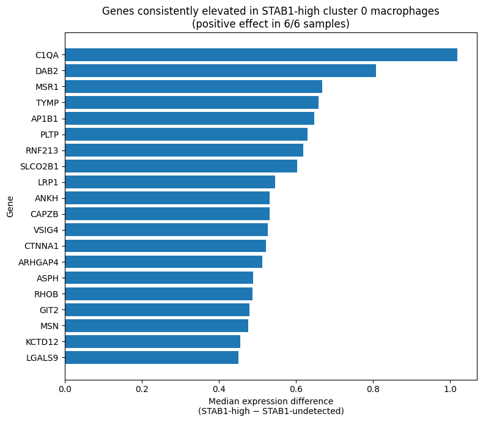
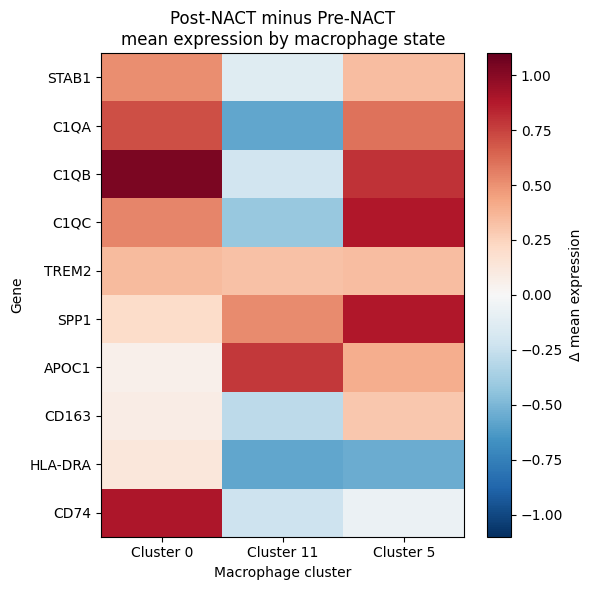
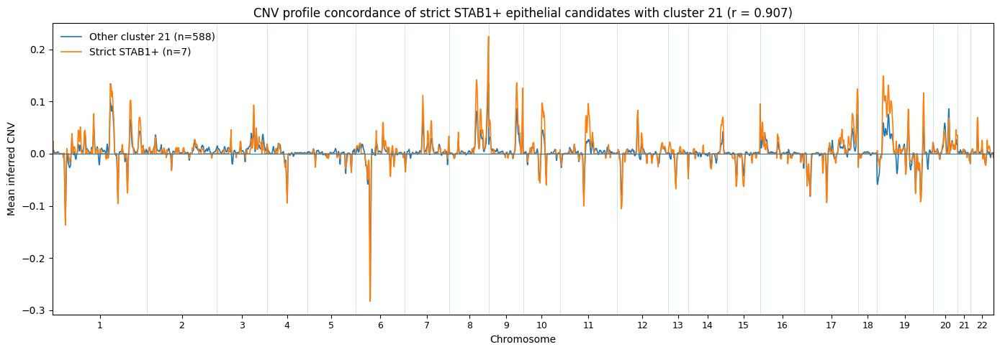

# STAB1 / Clever-1 expression in macrophage states in ovarian cancer scRNA-seq

## Overview

This project explores **STAB1 (Clever-1)** expression across macrophage states in single-cell RNA-seq data from high-grade serous ovarian cancer (HGSOC) omental metastases.

The analysis uses the public **GSE224392** dataset and combines a reproducible Scanpy reconstruction with results from an earlier exploratory analysis.

Main questions:

- Which macrophage states show the strongest STAB1 expression?
- Which transcriptional features are consistently associated with STAB1-high macrophages across patient samples?
- How do macrophage-state composition and STAB1 expression vary between Pre-NACT and Post-NACT samples?
- Is STAB1 expression detectable outside immune cells, particularly in epithelial- or endothelial-like populations?

Because the dataset contains independent Pre-NACT and Post-NACT patients rather than longitudinally paired samples, treatment comparisons are descriptive and are not interpreted as causal effects of chemotherapy.

## Dataset and workflow

- GEO accession: **GSE224392**
- 7 independent patient samples: 3 Pre-NACT and 4 Post-NACT
- 65,543 cells × 36,601 genes before QC
- 63,271 cells retained after QC
- normalization and log transformation
- 3,000 highly variable genes
- PCA and nearest-neighbor graph
- Leiden clustering (resolution 1.0)
- UMAP
- marker-gene and STAB1 expression analyses

Large raw data and `.h5ad` objects are not included in the repository. The workflow starts from the publicly available GSE224392 data.

## Main findings

### STAB1 is concentrated in distinct macrophage states

The strongest STAB1 expression in the reconstructed analysis occurred in **cluster 26**, characterized by **SPP1, APOE, APOC1, C1QA, C1QB, C1QC and TYROBP**. Approximately **75% of cells** in this population had detectable STAB1 expression.

Other STAB1-positive populations included C1Q/HLA-II/TREM2, GPNMB/APOC1 lysosomal, HLA-II-high, proliferating, and ACP5/CTSK/SPP1-associated myeloid/macrophage states.

These results indicate that STAB1 expression is heterogeneous across macrophage states rather than uniformly distributed across the myeloid compartment.

### Cross-sample STAB1-high signature

An exploratory within-sample comparison of STAB1-high and STAB1-undetected macrophages identified **256 genes with higher expression in STAB1-high cells in all six evaluable samples**. Sample 1 was excluded because it contained only one STAB1-high cell.

Examples include **C1QA, DAB2, MSR1, TYMP, PLTP, VSIG4, LRP1, SLCO2B1, LGALS9 and ANXA5**.

STAB1-undetected cells should not be interpreted as true biological STAB1-negative cells because scRNA-seq dropout and differences in transcript detection can affect this comparison.

### Functional heterogeneity

The exploratory analysis resolved multiple STAB1-positive macrophage phenotypes, including SPP1/APOE/APOC1/C1Q, C1Q/HLA-II and GPNMB/APOC1 lysosomal states. Their functional-marker patterns differed, arguing against interpretation of STAB1-positive macrophages as one uniform activation state.

### Exploratory STAB1 expression outside immune cells

STAB1 expression was also examined outside the myeloid compartment, with particular attention to epithelial- and endothelial-like cells.

A stringent epithelial-cell screen required detectable STAB1 expression together with at least two epithelial markers (**EPCAM, KRT8, KRT18, KRT19, MUC1**) and absence of seven canonical myeloid markers (**LST1, TYROBP, FCER1G, CD68, C1QA, C1QB, C1QC**). Only **10 cells** satisfied these criteria, indicating that convincing non-myeloid STAB1-positive cells were rare in this dataset.

An exploratory CNV-based analysis provided additional support for a tumor-like epithelial identity in a subset of these cells. However, the very small number of cells and the indirect nature of CNV inference prevent a definitive conclusion that STAB1 is expressed by malignant epithelial cells.

STAB1 expression was also explored in endothelial-like populations, but the evidence was weaker and was not sufficient to support a robust endothelial-specific conclusion.

These observations therefore suggest possible rare STAB1 expression outside the immune compartment, but should be regarded as **exploratory rather than confirmatory**.

## Exploratory vs reconstructed clustering

Cluster numbers are analysis-specific and must not be interpreted as directly equivalent between the exploratory and reconstructed workflows.

| Exploratory | Reconstructed | Marker-defined phenotype |
|---|---|---|
| Cluster 0 | Cluster 26 | STAB1-high, SPP1, APOE, APOC1, C1Q macrophages |
| Cluster 5 | Cluster 3 | C1Q, HLA-II, CD74, TREM2 macrophages |
| Cluster 11 | Cluster 2 | GPNMB, APOC1, APOE, CD68, lysosomal macrophages |

These correspondences are based on shared marker profiles and do **not** represent cell-by-cell mappings.

## Pre-NACT and Post-NACT comparisons

STAB1 expression and macrophage-state abundance were examined per patient sample and summarized by treatment group. The analyses show substantial inter-patient heterogeneity.

Because there are only three Pre-NACT and four Post-NACT independent samples, the large number of cells does not increase the number of biological replicates. Pre/Post comparisons are therefore descriptive rather than evidence that NACT causes the observed differences.

## Limitations

- Seven independent patient samples
- Unpaired Pre-NACT and Post-NACT groups
- Substantial inter-sample heterogeneity
- scRNA-seq dropout and variable transcript detection
- STAB1-high comparisons may be influenced by technical and library-size differences
- Cluster correspondence is based on marker profiles rather than direct cell mapping

Independent cohorts are required to validate the macrophage-state patterns and treatment-associated observations.

## Repository structure

- `notebooks/01_STAB1_scRNA_analysis.ipynb` — analysis notebook
- `figures/` — selected analysis figures
- `results/` — numerical result tables
- `requirements.txt` — Python dependencies

## Reproducibility

The final reconstruction was performed in Python using Scanpy with a fixed random seed of 42. The neighbor graph used 15 nearest neighbors and 30 PCs; Leiden clustering used resolution 1.0.

## Interpretation

The principal result is that **STAB1/Clever-1 expression is associated with specific macrophage transcriptional states**, with the strongest signal in an SPP1/APOE/APOC1/C1Q-associated population.

The cross-sample analysis additionally identifies a consistent STAB1-high-associated macrophage signature across six evaluable patient samples.

These findings are hypothesis-generating and should not be interpreted as evidence that STAB1 causes these transcriptional programs or that NACT causes the observed differences between treatment groups.

## Author

**Jukka Kiuru, MSc Human Molecular Genetics | BEng Biotechnology**

GitHub: **JukkaMK**
